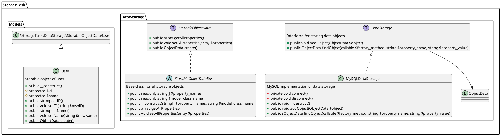

# Logical View

```puml
@startuml
namespace StorageTask {
    

    namespace DataStorage {
        
        interface DataStorage {
            Interfarce for storing data objects
            ..
            +public void addObject(ObjectData $object)
            +public ObjectData findObject(callable $factory_method, string $property_name, string $property_value)
        }
        class MySQLDataStorage implements DataStorage {
            MySQL implementation of data storage
            ..
            -private void connect()
            -private void disconnect()
            +public void __destruct()
            +public void addObject(ObjectData $object)
            +public ?ObjectData findObject(callable $factory_method, string $property_name, string $property_value)
        }
        interface StorableObjectData {
            +public array getAllProperties()
            +public void setAllProperties(array $properties)
            {static} +public ObjectData create()
        }
        abstract class StorableObjectDataBase implements StorableObjectData {
            Base class  for all storable objects
            ..
            +public readonly string[] $property_names
            +public readonly string $model_class_name
            +public __construct(string[] $property_names, string $model_class_name)
            +public array getAllProperties()
            +public void setAllProperties(array $properties)
        }
        DataStorage --> ObjectData
    }
    namespace Models {
    
        class User extends \StorageTask\DataStorage\StorableObjectDataBase {
            Storable object of User
            ..
            +public __construct()
            #protected $id
            #protected $name
            +public string getID()
            +public void setID(string $newID)
            +public string getName()
            +public void setName(string $newName)
            {static} +public ObjectData create()
        }   
    }
}
@enduml
```