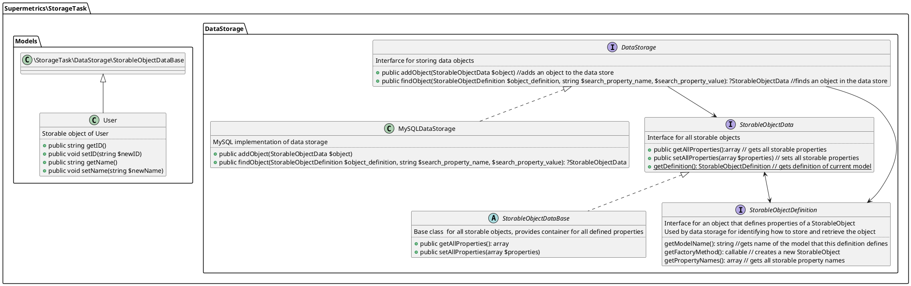

# Logical View

```puml
@startuml
namespace Supermetrics\StorageTask {
    

    namespace DataStorage {
        
        interface DataStorage {
            Interfarce for storing data objects
            ..
            +public addObject(StorableObjectData $object) //adds an object to the data store
            +public findObject(StorableObjectDefinition $object_definition, string $search_property_name, $search_property_value): ?StorableObjectData //finds an object in the data store
        }
        class MySQLDataStorage implements DataStorage {
            MySQL implementation of data storage
            ..
            +public addObject(StorableObjectData $object)
            +public findObject(StorableObjectDefinition $object_definition, string $search_property_name, $search_property_value): ?StorableObjectData
        }
        interface StorableObjectData {
            Interface for all storable objects
            ..
            +public getAllProperties():array // gets all storable properties
            +public setAllProperties(array $properties) // sets all storable properties
            {static} +getDefinition(): StorableObjectDefinition // gets definition of current model
        }
        abstract class StorableObjectDataBase implements StorableObjectData {
            Base class  for all storable objects, provides container for all defined properties
            ..
            +public getAllProperties(): array
            +public setAllProperties(array $properties)
        }
        interface StorableObjectDefinition {        
            Interface for an object that defines properties of a StorableObject
            Used by data storage for identifying how to store and retrieve the object
            ..
            getModelName(): string //gets name of the model that this definition defines
            getFactoryMethod(): callable // creates a new StorableObject
            getPropertyNames(): array // gets all storable property names
        }

        DataStorage --> StorableObjectData
        StorableObjectData <--> StorableObjectDefinition
        DataStorage --> StorableObjectDefinition
    }
    namespace Models {
    
        class User extends \StorageTask\DataStorage\StorableObjectDataBase {
            Storable object of User
            ..
            +public string getID()
            +public void setID(string $newID)
            +public string getName()
            +public void setName(string $newName)
        }   
    }
}
@enduml
```